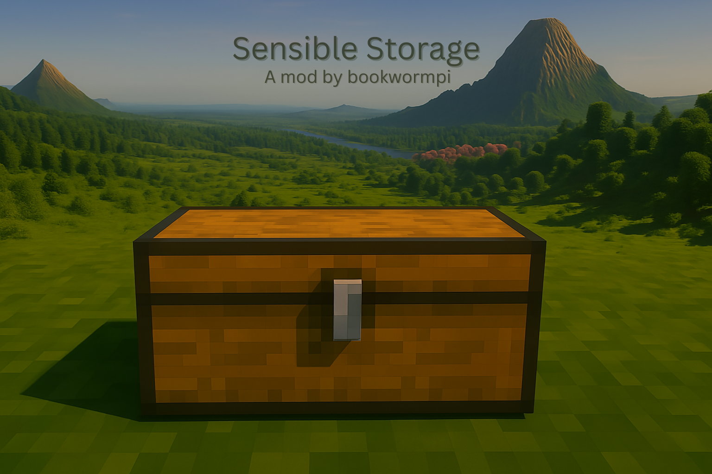

# Sensible Storage

A Fabric client-side mod that adds intelligent memory slots to containers, inspired by SophisticatedBackpacks!

## 🧠 Features

- **Smart Memory Slots**: Configure containers to remember which items belong in each slot
- **SB-Style Interface**: Familiar brain icon button matching SophisticatedBackpacks design
- **Persistent Storage**: Memory templates are saved between game sessions
- **Visual Ghost Items**: See what items belong in empty slots with translucent previews
- **Memorization Mode**: Toggle mode to easily set up memory templates by clicking
- **Item Filtering**: Prevents placing wrong items in slots with active memory templates
- **Universal Compatibility**: Works with chests, barrels, shulker boxes, and more

## 📦 Installation

### Requirements
- **Minecraft**: 1.21.5
- **Fabric Loader**: 0.16.14 or higher
- **Fabric API**: Required
- **Java**: 21 or higher

### Steps
1. Download the latest release from the [Releases page](https://github.com/bookwormpi/sensiblestorage/releases)
2. Install [Fabric Loader](https://fabricmc.net/use/) for Minecraft 1.21.5
3. Download [Fabric API](https://modrinth.com/mod/fabric-api)
4. Place both JAR files in your `mods` folder
5. Launch Minecraft with the Fabric profile

## 🎮 Usage

### Setting Up Memory Slots

1. **Open any container** (chest, barrel, etc.)
2. **Click the brain icon** 🧠 button on the right side to enter memorization mode
   - Gray button = memorization mode off
   - Green button = memorization mode on
3. **Click on slots** while in memorization mode to set memory templates:
   - **Left-click**: Set the item in your cursor as the memory template
   - **Right-click**: Clear the memory template for that slot
4. **Click the brain icon again** to exit memorization mode

### Using Memory Slots

- **Ghost Items**: Empty slots with memory templates show a translucent preview of the expected item
- **Smart Filtering**: You can only place items that match the memory template in each slot
- **Persistent Memory**: Templates are automatically saved and restored between sessions

### Commands

- `/sensiblestorage memory stats` - View memory statistics
- `/sensiblestorage memory save` - Manually save memory data

## 🔧 Configuration

Memory templates are automatically saved to `.minecraft/sensiblestorage/` and persist across game sessions. No manual configuration required!

## 🎯 Compatibility

### Supported Containers
- Chests (single & double)
- Barrels
- Shulker Boxes
- Hoppers
- Dispensers & Droppers

### Mod Compatibility
- **REI (Roughly Enough Items)**: Fully compatible
- **Storage mods**: Generally compatible with most inventory mods (I think, make an issue if not. ;))

## 🐛 Known Issues

- None currently known. Please report any issues on the [Issues page](https://github.com/bookwormpi/sensiblestorage/issues)!

## 🤝 Contributing

Contributions are welcome! Please feel free to:
- Report bugs via [Issues](https://github.com/bookwormpi/sensiblestorage/issues)
- Submit feature requests
- Create pull requests

## 📝 Credits

- **Inspiration**: [SophisticatedBackpacks](https://github.com/P3pp3rF1y/SophisticatedBackpacks) by P3pp3rF1y
- **Framework**: Built with [Fabric](https://fabricmc.net/)
- **Brain Icon**: Uses emoji for universal compatibility

## 📄 License

This project is licensed under the CC0-1.0 License - see the [LICENSE](LICENSE) file for details.

## 🔗 Links

- **Download**: [Releases](https://github.com/bookwormpi/sensiblestorage/releases)
- **Issues**: [Bug Reports](https://github.com/bookwormpi/sensiblestorage/issues)
- **Fabric**: [fabricmc.net](https://fabricmc.net/)

---

**Made with ❤️ for the Minecraft Fabric community**

*If you enjoy this mod, consider giving it a ⭐ on GitHub!*

